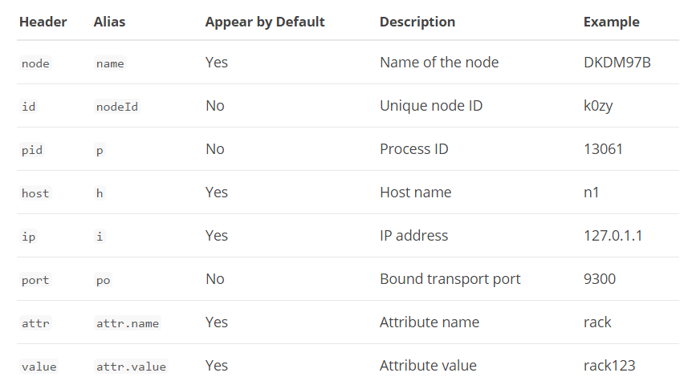

# cat nodeattrs
The nodeattrs command shows custom node attributes

for example here:
```
[xiaohu-liu@cdh1 ~]$ curl -X GET 'http://localhost:9200/_cat/nodeattrs?v'
node host ip attr value
```

Below is an exhaustive list of the existing headers that can be passed to nodeattrs?h= to retrieve the relevant details in ordered columns
<center>  </center>

When specifying headers, the headers are not placed in the output by default. To have the headers appear in the output, use verbose mode (v). The header name will match the supplied value (e.g., pid versus p). For example:
```
[xiaohu-liu@cdh1 ~]$ curl -X GET 'http://localhost:9200/_cat/nodeattrs?v&h=name,pid,attr,value'
name pid attr value
```

