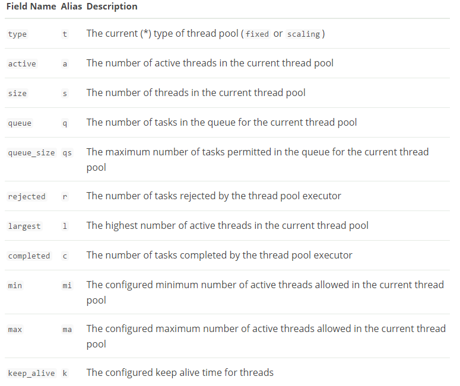
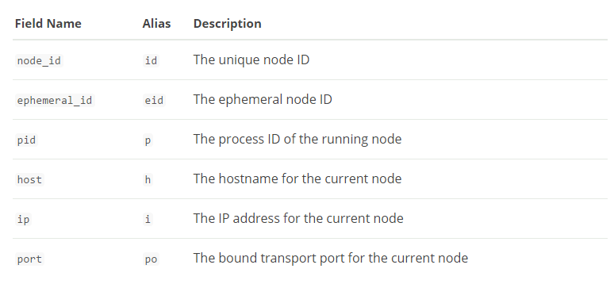

# cat thread_pool

The thread_pool command shows cluster wide thread pool statistics per node. By default the active, queue and rejected statistics are returned for all thread pools. for example here
```
[xiaohu-liu@cdh1 ~]$ curl -X GET 'http://localhost:9200/_cat/thread_pool?v'
node_name name                active queue rejected
cdh1      bulk                     0     0        0
cdh1      fetch_shard_started      0     0        0
cdh1      fetch_shard_store        0     0        0
cdh1      flush                    0     0        0
cdh1      force_merge              0     0        0
cdh1      generic                  0     0        0
cdh1      get                      0     0        0
cdh1      index                    0     0        0
cdh1      listener                 0     0        0
cdh1      management               1     0        0
cdh1      refresh                  0     0        0
cdh1      search                   0     0        0
cdh1      snapshot                 0     0        0
cdh1      warmer                   0     0        0
```

## Thread Pool field
For each thread pool, you can load details about it by using the field names in the table below.
<center></center>

## Other field
In addition to details about each thread pool, it is also convenient to get an understanding of where those thread pools reside. As such, you can request other details like the ip of the responding node(s).
<center></center>

